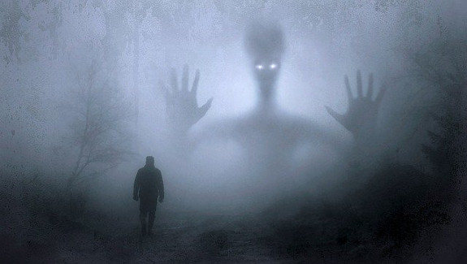

#Angst

Ein nicht ganz unwichtiges Thema ist die Angst.  
Wenn wir vor etwas Angst haben, dann sind wir auf das, was uns in unseren Gedanken quält sehr fokussiert. Und wenn wir uns auf etwas fokussieren, dann ziehen wir es in unsere Realität.  

Erinnerst du dich an das zählen der grünen Autos?  

Wenn wir nun zum Beispiel Angst davor haben, eine Prüfung zu versemmeln, dann werden wir sie auch versemmeln.  
Wenn wir Angst davor haben, beim Schwarzfahren erwischt zu werden, dann werden wir auch erwischt.  

Das ist das Gesetz der Anziehung!  

Wie wäre es nun, wenn wir dieses Gesetz für uns nutzen?
Wir haben das vor ein paar Jahren mal auf einem Rainbow-Gathering gemacht.
Es hat geregnet und wir, eine liebe Freundin von mir und ich sassen im Zelt und uns war langweilig.  

Wir wollten beide mit ein paar Frauen kuscheln. 

Nun fing ich an zu sagen, "Ich habe voll Angst, das gleich zwei Frauen zu uns ins Zelt kommen, ihre nassen Klamotten ausziehen und sich zu uns legen."
Meine Freundin hat sofort gewusst, was ich vor hatte und bog in die selbe Kurve ein. "Ich hab auch voll Bammel, das gleich zwei schöne Frauen zu uns ins Zelt kommen und wir eine tolle Zeit miteinander haben.", sagte sie.

Du wirst es kaum Glauben, es dauerte keine 10 Minuten und...  
Eigentlich finde ich es voll blöd, keine Namen nennen zu können, denn das nimmt diesem Buch die Authenzität, aber ich möchte meine Freude damit schützen.

10 Minuten später kam dann eine weitere Freundin zu uns ins Zelt und ich gab ihr eine Tantramassage. Anschließend kuschelten wir alle zusammen. Nach weiteren 20 Minuten hörte ich draußen "Art Connection". Man suchte mich. Es war eine liebe Freundin, die ich auf diesem Gathering kennengelernt hatte. Sie wollte sich von mir verabschieden.  

Die Manifestation war komplett.

Um ehrlich zu sein, mag ich diese Art der Manifestation nicht wirklich, denn ich mag keine Ängste.

Ich habe dieses Kapitel nur noch hier erwähnt, weil wir uns leider sehr leicht im Außen beeinflussen lassen und alles glauben, was man uns so erzählt.  

Uns wird bewusst Angst gemacht und wenn wir dann an diese Dinge glauben, dann ziehen wir sie in unser Leben.  

Ich persönlich musste erst einmal sterben, um Angstfrei zu werden. Ja, ich hatte 2014 nach meinem Burnout ein Nahtoderlebnis. Erst seit dem bin ich Angstfrei.

Würde ich nun aber noch in der Stadt leben und mit dem, was da so alles passiert konfrontiert werden, dann könnte ich rückfällig werden. Zumindest würde ich dann öfter als mir lieb ist mit Dingen konfrontiert, die Angst machen könnten.  
Außerdem ist es schwer mit anzusehen, das die Menschen um mich herum Angst haben. Das sind keine schönen Spiegel.  

Zum Glück können wir uns aussuchen, wo und wie wir leben wollen. 