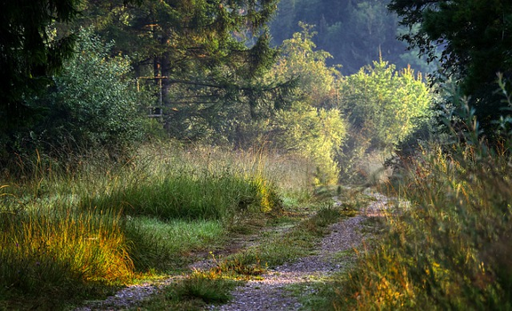

#Inspiration
von Eo

Ich wache morgens auf, wenn die ersten Sonnenstrahlen auf mein Gesicht treffen. In Stille gehe ich zu einem Baum, ich nähere mich langsam und behutsam, lege, nach einer innerlich ausgesprochenen Begrüßung sanft meine Hand an den Stamm und spüre den Kontakt. Ich lasse den Kontakt auf mich wirken. Ich weiß um die Weisheit des Baumes, um seine Gelassenheit und Kraft.  
Der Baum erinnert mich. Jeden Tag hilft er mir mich zu erinnern.  
Wir sind geschaffen, um in Liebe zu leben. Einige Jahre meines Lebens habe ich, sowie die meisten meiner Mitmenschen in der Ablenkung gelebt. Wir haben uns förmlich gegenseitig immer wieder von der Natur allen Seins abgelenkt. Und sind dabei in jede Menge Illusionen von Abhängigkeiten geraten. Einzig und allein, weil wir die Natur allen Seins vergessen hatten.
Ich bin sehr tief berührt und dankbar, dass vor einigen Jahren ein Bewusstseins Shift in allen Menschen stattgefunden hat, der uns alle an die Wahrheit unseres Seins erinnert hat, die Natur. Wir alle sind ein Teil der Natur. Die Natur ist wie eine große Mutter und versorgt uns alle. Vielmehr sagen wir heute, sie beschenkt uns alle, denn Sorgen sind keine mehr nötig. Wir leben im Einklang mit der Natur. Wir dürfen uns freuen, wenn sie uns mit süßen Früchten beschenkt. Freude ist unser wahrer Zustand. Wir brauchen nichts. Dieses Gefühl überwältigt mich jedes Mal, ich schaue mit Liebe aus meinem Inneren durch meine Augen in die Welt, die mich jetzt in diesem Moment umgibt,  und ich will nichts als tief einatmen und ausatmen.  
Ich bedanke mich bei dem Baum und löse meine Hand.  
Ich wende mich zur Sonne (ganz gleich, ob ich sie gerade sehe oder ob sie von Wolken bedeckt ist) und fülle mich mit Licht. Ich spüre meine Füße auf dem Boden. Dieses Gefühl versichert mir mein Vertrauen. Ich bin hier, ich gehöre hier her, ich bin getragen.   
Die pure Lebensfreude, die mich dabei überkommt, lässt mich leichtfüßig fast tänzelnd über die Wiese laufen.  
An manchen Stellen ist das Gras sehr hoch und ich spüre wie es meine Haut sanft kitzelt. Ich genieße das kribbeln und erfreue mich daran. Ein anderes Menschenkind springt über die Wiese, ein Stück weiter entfernt spielt jemensch mit den Tieren, die dort gerade Lust darauf haben. Ich schlendere über die bunte Wiese und lasse mich treiben.  
Ich genieße die allmählich stärker werdende Wärme der morgendlichen Sonnenstrahlen auf meiner nackten Haut.  
Ich sehe einen Mensch an einen Baum gelehnt stehen und spüre bei meinem Anblick dessen einfach etwas sehr liebevolles, zärtliches, Bewunderung für die kleinen Details. Der Bauch dieses Menschen zieht mich wie magisch an und ich gebe ihm einen sehr liebevollen Streichler. Der Mensch atmet die Berührung genießend ein und lächelt sanft.  
Ich gehe schon weiter, denn ich bin voller Energie. Ich schwimme durch den Fluss und spiele am anderen Ufer mit ein paar anderen als wären wir Hunde Welpen.  
Ab und an finde ich ein paar schöne Wildkräuter und Beeren, von denen ich ein wenig nasche.
Mein Spaziergang führt mich heute weiter auf eine andere Wiese, die ich noch als Wiese in einem Park kenne. Dieser Park existiert auch noch, nur sind seine Grenzen eigtl nicht mehr zu erkennen. Früher gab es nämlich in der Stadt Straßen, vor allem für Autos und Busse, aber auch Fahrräder nutzten die Straßen ab und an. Diese Straßen umgaben den Park, und an die Straße grenzten viele Häuser an. Auch die Häuser gibt es noch. Aber da es keine Straßen mehr gibt, ist jetzt auch grün überall zwischen den Häusern. Die Grenze zwischen Park und Wohngebiet ist komplett verschwommen. Die Häuser sind zum Teil grün bewachsen. Im Gegenteil zu früher, sehen sie sehr natürlich im Gesamtbild des ewigen Parks aus. Ewig deshalb weil mensch sagen könnte, dass die ganze Welt ein Park ist, sich dieser also überall hin erstreckt und gar keine Grenze hat.  
A propos, da fällt mir ein, dass es ja früher auch Landesgrenzen gab. Die gibt es nicht mehr. Ich kann wandern wie und in welche Richtung ich möchte.  
Die Menschen sowie alle Wesen hier sind sehr frei. Alles andere wäre auch sehr unnatürlich und dadurch komisch.  
Aber bleiben wir noch kurz bei meiner Erinnerung an die Straßen. Wow, es macht mir so viel Freude all dieses grün, überall Wiese und Pflanzen zu sehen.  
Ja, die Straßen wurden nicht mehr gebraucht. Zunächst wurden kleine fliegende Kapseln erfunden, die allen zum schnellen Transport von A nach B zur Verfügung standen. Das war allerdings fast überflüssig und es gab sie nur sehr kurz, denn der Bewusstseinswandel war schon im Gange und die Menschen lernten sich zu teletransportieren. Gleichzeitig dazu, dass sie diese Fähigkeit entwickelten, brachte das neue Bewusstsein aber auch eine so allumfassende Zufriedenheit mit sich, dass wir Menschen (sowie alle anderen Wesen auch) keine Bedürfnisse mehr verspürten, es also gar keine Notwendigkeit zum Reisen mehr gab. Dadurch, dass wir mehr und mehr anfingen und mit der häufigeren Nutzung immer geübter darin wurden, unsere Intuition und "siebten", den telepathischen, Sinn zu nutzen, können wir jeden Menschen, jeden Ort, jede Zeit jederzeit besuchen.  
Vielleicht kann ich es ein wenig mit dem früheren Telefonieren vergleichen, wenn ich jetzt per Telepathie meine Oma besuche und mit ihr spreche. Das Internet half uns dabei diesen großen Sprung zu machen, da es immer besser darin wurde, die Illusion möglichst real, in möglichst vielen Facetten zu übermitteln. Ich erinnere mich, erst gab es das Telefon, wo mensch nur den anderen hörte, dann gab es das mit Bild, dann mit Video, mit mehreren Menschen verschiedener Orte gleichzeitig, und so weiter. Bis wir schließlich diese Wellen, mit denen die Geräte das alles übertragen haben, selbst wahrnehmen und senden konnten. Das konnten wir eigentlich immer, nur hatten wir das vergessen zu nutzen und waren nicht geübt darin.  
Also Strom verwenden wir heute auch nicht mehr, weil es diese Geräte nicht mehr gibt, die Strom brauchten.   

Ich spüre eine Umarmung. Jemensch kam von hinter mir ebenfalls über die Wiese und erfreute sich mich zu sehen.  
Mmmhhh, ich spüre die Wärme dieses anderen Körpers und rieche den Duft.  
Ich drehe mich um und fühle mich sehr lustvoll. Wir fühlen uns beide sehr aufgeladen, und, wo ich doch gerade an Strom dachte, wir lassen den Strom durch uns fließen. Ich gebe mich meiner Lust und Ekstase hin. Ah, es ist so erfrischend, so frei! Dieser Mensch gibt mir einen Kuss und streicht mir sanft über Haare und Schultern, und zieht dann weiter ihres*seines Weges.  
Ich genieße mein Ein- und Ausatmen, und lächle. Für eine Weile bleibe ich so.  

Unsere Sprache ist viel einfacher geworden, wir sprechen auch gar nicht viel, wir spüren viel mehr. Wir nutzen das Spüren auch als Kommunikation.  

Ich höre Musik und schlendere in die Richtung, aus der ich das höre. Hinter dem Haus, das was früher ein Parkplatz war, ist jetzt ein wunderschöner Garten, ist eine Gruppe am Musizieren und Tanzen. Die Musizierenden inspirieren die Tanzenden zu ihren Bewegungen, die Tanzenden motivieren wiederum die Musizierenden zu kräftigeren und sanfteren Rhythmen und Klängen. Es gibt hier keine Form mehr davon, wer Musik und wer Tanz macht. Die Schönheit fließt durch alle, das genieße ich zu sehen und bin auch schon mittendrin im selbst musizierenden Tanzen.  

Inzwischen ist es fast Abend geworden, ich blicke einem Wesen aus der Tanzgruppe in die Augen. Für viele Minuten, Sekunden, Stunden (ich weiß es nicht, wir haben keine Zeitrechnung mehr) blicken wir uns ununterbrochen an, und in diesem Blick blicken wir in einander hinein. Ich empfange diesen Blick, und es öffnet mein Herz. Unsere beiden Herzen gehen auf und wir blicken ins Universum. Wir liegen im Gras und blicken ins Universum bis es so dunkel geworden ist, dass die Sterne über uns funkeln.  
Die Erde riecht jetzt nach Regen, daher gehe ich lieber ins Haus zum schlafen.   
Die Häuser sind die von früher. Sie werden zwar kaum noch bewohnt, sind aber sehr gepflegt. Alle Menschen sind sehr liebevoll und daher auch achtsam und pflegsam mit allem was es auf der Welt gibt.  
Ich nehme die freie Wohnung im Dachgeschoss. Abgesehen von meiner Intuition kann ich an einer Markierung erkennen, dass diese Wohnung gerade nicht von jemensch anderem genutzt wird. Es gibt quasi keine festen Wohnungen mehr. Mensch ist, wo mensch gerade ist. Am morgen gibt es meist keinen Plan für den Tag, von daher ist es auch sehr praktisch, dass wir quasi überall sein und schlafen können. Ich habe schon vergessen, wie das Gefühl war mit Autoritäten, mit Miete und so, zu leben. Das war sehr kompliziert.   

Ich liebe wie einfach jetzt alles ist, und wir einfach sind!  

Und während ich einfach bin, ist neben mir auch dieses wunderschöne Wesen. Und während wir einfach mit unserem Herz in das Universum blicken, sinken wir in einen Schlaf, der uns in den nächsten Tag trägt.