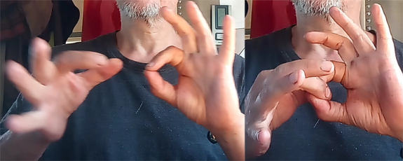
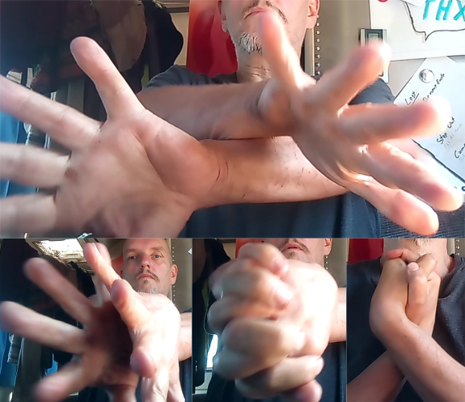

# Psych-K

Psych-K ist eine Methode mit der du Glaubenssätze löschen und umprogrammieren kannst.

Psych-K ist eine sehr gute und schnelle Methode, um dein Unterbewusstsein neu zu programmieren. Mit dieser Methode kombinierst du beide Teile des Gehirns, gehst in einen meditativen Geisteszustand über und überlegst dir, woher dieser Glaube kommt. Oft kommen Überzeugungen von Eltern, Brüdern, Schwestern, Freunden, der Schule usw.. Nicht alle Überzeugungen basieren auf einer soliden Erfahrung von uns selbst. Selbst wenn wir eine Erfahrung gemacht haben, glaubt und reagiert unser Unterbewusstsein immer noch auf der Grundlage von Überzeugungen. Wenn ich sage, dass es reagiert, meine ich, dass wir die meiste Zeit mit Autopilot fahren. Erinnerst du dich an das erste Mal, als du mit dem Fahrrad gefahren bist? Ich musste an fast jeden einzelnen Muskel denken, um mich zur richtigen Zeit in der richtigen Reihenfolge zu bewegen. Heute denke ich nicht einmal mehr an meine Muskeln. Ich fahre einfach irgend wohin. Mein Unterbewusstsein macht das alleine. Gleiches gilt für Atmung, Herzschlag, das Wachsen der Fingernägel, das Heilen der Wunden, das Wachsen der Haare sowie das Spalten und Regenerieren von Zellen. Alles auf Autopilot. Wenn wir uns also neu programmieren, können wir unser Leben komplett verändern. Dies gilt auch für Ängste. Und mit dieser Methode ist es möglich, Dinge zu manifestieren.

## Muskeltest (Kinesologie)

Um Psych-K durchführen zu können, benötigen wir noch eine zusätzliche Methode, den Muskeltest.  
Man kann diesen Muskeltest zu zweit durchführen, ich zeige dir hier aber die Version, die du auch alleine durchführen kannst.  

Berühre dafür bitte den Daumen der linken Hand mit dem Zeigefinger der linken Hand und bilde so einen Kreis. Nun machst du selbiges mit den Fingern der rechte Hand und führst diese beiden Kreise ineinander.  

Denke nun an das Wort "JA" und versuche deine Finger, also die beiden Kreise, auseinander zu ziehen. Merke dir bitte, wie viel Kraft du dafür aufgewendet hast.  
Nun denke an ein "NEIN" und versuche wiederum die Finger auseinander zu ziehen.  
Hierfür sollte nun weniger Kraft nötig gewesen sein, da dein Körper beim Gedanken an ein Nein eher in Stress kommt und dabei die Muskeln nicht so viel Kraft haben.  
Mache diesen Test gleich noch einmal. Nutze nun in beiden Tests genau so viel Kraft, wie es nötig war, um deine Finger bei einem Nein auseinander zu ziehen, aber nur so viel, das die Finger bei einem Ja zusammen bleiben.  
Spiele ein wenig damit herum. Sage zum Beispiel: "Mein Name ist ..." Ersetze die Punkte mit deinem Namen. Die Antwort deines Körpers in Form von Kraft, sollte Ja sein. Setzte nun einen anderen Namen als deinen ein und mache den Test erneut. Die Finger sollten nun auseinander gehen. Die Antwort ist also Nein.  
Mit dieser Methode kannst du unter anderem aktive limitierende Glaubenssätze in deinem Unterbewusstsein aufspüren.  
Möchtest du zum Beispiel ein eigenes Haus für dich und deine Kinder manifestieren wollen. In deinem Unterbewusstsein aber ein limitierenden Glaubenssatz aktiv sein, der das verhindert oder dich zweifeln lässt, so kannst du dir die Manifestation sparen.  

Reinige hierfür erst einmal deine Programmierung. Lösche hierfür erst einmal den limitierenden oder behindernden Glaubenssatz auf.  
Sage dir zum Beispiel: "Ich schaffe es nicht, ein eigenes Haus für mich und meine Kinder zu manifestieren." und mache dann den Muskeltest. Aber Vorsicht, zuerst einmal musst du den zu überprüfenden Glaubenssatz anpassen, denn wir haben es hier mit einer Verneinung zu tun. Denke bitte nicht an einen rosa Elefanten.  
Und an was hast du gedacht? An einen rosa Elefanten?  
Ich sagte aber, denke bitte NICHT...  
Wie du sehen kannst, bekommt nicht einmal dein Bewusstsein diese Verneinung mit. genau so ist es mit deinem Unterbewusstsein.  
Mir müssen also wie folgt testen: "Ich schaffe es, ein eigenes Haus für mich und meine Kinder zu manifestieren."  

Bleiben deine Muskeln bei diesem Test stark? Dann können wir den nächsten Schritt überspringen. Geben deine Finger jedoch nach, dann müssen wir diesen Glaubenssatz löschen oder umwandeln.

##Glaubenssatz mit Psych-K löschen
Hierfür setze dich bitte auf einen Stuhl, eine Bettkante oder auf den Boden.  
Kreuze nun deine Beine bzw.. deine Füße übereinander. Prüfe nun mittels dem Muskeltest, ob die Füße richtig herum gekreuzt wurden. Ist der Test negativ, dann kreuze die Füße anders herum.  

Verschränke nun deine Hände und drehe sie in Richtung deiner Brust herum.  
Stelle dir nun die Frage, ob die Hände richtig herum gekreuzt wurden. Im Falle von Ja, tendiert dein Körper eher nach vorne zu kippen und im Falle von Nein, tendiert dein Körper eher nach Hinte zu kippen.  

Korrigiere deine Hände bei Bedarf.  

Schließe nun die Augen und atme drei mal tief in dein Becken herunter ein.
Beobachte deinen Atem eine Zeit lang und kontempliere nun über deinen zu löschenden Glaubenssatz.  
- Was kommen da für Gedanken dazu hoch?  
- Von wem kommt dieser Glaubenssatz?  
- Wann ist der Glaubenssatz in dein System gekommen?

Schaue die die Bilder die da kommen könnten genau an. Spüre rein, was es mit dir macht.  

Ich hatte vor ein paar Jahren noch den nachfolgenden Glaubenssatz aktiv: "Ich bin zu klein". Glaube mir, dieser Glaubenssatz hat es in sich und viele von uns schleppen den oder "Ich bin zu groß" mit sich herum. Bei mir war es die Schule die den Glaubenssatz in mein Unterbewusstsein gepflanzt hatte. Einer meiner Lehrer oder eher der Schularzt bat meine Eltern mit mir, ich war gerade mal 12 Jahre alt, zum Arzt zu gehen und etwas mit meiner Größe zu machen. Ich war tatsächlich nicht der größte in meiner Klasse.  

Nun stand ich da und meine Mutter sagte: "Herr Doktor, Olaf ist zu klein für sein Alter, kann man da denn nichts dagegen tun ?"  
Kannst du dir vorstellen, was das mit klein Olaf gemacht hat?  
Seit dem Tag wurde ich wegen meiner Größe von den anderen Schülern gehänselt.  
Daran sind gar nicht mal die anderen Schüler schuld. Nein, ich selber habe das ab dem Tag ausgestrahlt und dementsprechend angezogen, denn ich war ja zu klein. Das konnte mir jeder dort draußen bestätigen.  

So nun habe ich diesen Glaubenssatz im alter von 53 glaube ich, mittels Psych-K gelöscht. In meiner Sitzung kam mir ein Bild, in der ich in der Schule von anderen größeren Schülern umgeben war und alle auf mich herabgeblickt und mich gehänselt haben. Ich glaube, das habe ich so in der Art nie wirklich erlebt, aber in dieser Sitzung sah ich es halt so. Das machte mich richtig traurig. Ich leidete dies noch einmal so richtig aus.  
Nachdem ich die Qualen hinter mich gebracht hatte, sagte ich mir: "Du bist in der Lage die Realität zu verändern, manifestiere in Zukunft einfach nur noch kleine Menschen in dein Leben."  
Das fand ich als einen tollen Einfall. Und ja, zu diesem Zeitpunkt wusste ich bereits von einem buddhistischen Mönch, das wir unsere Realität selber erzeugen.  

Drei Jahre nach dieser Sitzung bin ich in Portugal angekommen und hier sind die Menschen tatsächlich etwas kleiner als in Deutschland. Manifestation abgeschlossen.  

Nun aber zurück zum Thema. Versuche also alle Details zu deinem Glaubenssatz aufzuschnappen und auszuleiden, wenn nötig.  
Dann denke bitte über den neuen Glaubenssatz beziehungsweise über den für dich richtigen Glaubenssatz nach. Ist es wirklich das, was du bewusst glaubst? Wie fühlt es sich nun an? Fühlt es sich jetzt richtig an? Kommen da eventuell ein paar Schauer über deinen Rücken oder hast du Gänsehaut?  
Sage dir nun den neuen Glaubenssatz leise und lasse ihn in dein Unterbewusstsein sinken.  
Dadurch, das du deinen Arme und Beine verschränkt hast, haben sich deine beiden Gehirnhälften aktiviert. Die linke Gehirnhälfte steuert die rechte Körperseite und die rechte steuert die linke Seite. Durch die Verschränkung sind nun beide aktiv und alles was du nun in deinem meditativen Zustand denkst und vor allen Dingen fühlst, geht direkt in dein Unterbewusstsein über.  

Nachdem du nun deinen Glaubenssatz verankert hast, löst du die Verschränkung und versuchst an etwas ganz anderes oder noch besser an nichts oder einfach nur an deine Atmung zu denken. 

Abschließend prüfst du nun mittels dem Muskeltest, ob der Prozess abgeschlossen ist und öffnest langsam die Augen.  

##Manifestation mittels Psych-K
Der Prozess zum Manifestieren von Dingen oder Situationen sieht ähnlich dem der Glaubenssätze aus. Eigentlich fügst du auf diese Weise einen neuen Glaubenssatz hinzu. Im Falle des eigenen Hauses fügst du deinem Unterbewusstsein ein Programm hinzu, das dafür sorgt, das du ein eigenes Haus bekommst. Das ist wie mit den Placebos. Wenn du fest daran glaubst, das dir diese **Zuckerpille** (Placebo) dabei hilft, gesund zu werden, dann wirst du auch gesund.  
Unser Glaube versetzt Berge heißt es in einem alten Buch. Ich habe die Bibel zwar nie gelesen, aber dieser Satz ist mir wohl bekannt.  

Du kreuzt also wieder deine Beine und Arme und gehst in einen meditativen Zustand über.  
Die Meditation kannst du am besten damit einleiten, dass du anfängst bewusst, tief in dein Becken zu atmen. Stelle dir nun deinen Wunsch vor deinem inneren Auge vor. Versuche jedes Detail aufzuschnappen bzw. zu visualisieren. Spüre, wie sich das alles anfühlt. Träume deinen Traum. Wenn dein Wunsch wirklich im Einklang mit deinem Herzen ist, dann wirst du es sicher spüren können. Dann lacht dein Herz. Dann kullern die Tränen. Dann spürst du wie deine Aura immer größer wird. Dann fühlst du dich immer mehr wie ein Gott oder eine Göttin. Dann kommst du deinem höheren Selbst immer näher.  

Es gibt da draußen zwar einige Buchautoren, die auch über die Manifestation und das Gesetz der Anziehung schreiben. Die schreiben auch darüber, das man auch viel Geld und Reichtum in sein Leben ziehen kann, aber ist das wirklich wirklich wichtig?  

Müssen wir erst reich werden, um uns unser Kraft bewusst zu werden?

Ich war vor einigen Tagen tatsächlich kurz davor, mir ein passives Einkommen in Höhe von 30.000 Euro zu manifestieren. Ich wollte damit eigentlich nur testen, ob ich wirklich schon so etwas wie ein Gott bin. Und so ganz nebenbei hätte ich dann wieder Geld für einen Sportwagen und ein Haus am Strand.  
All diese Ideen kamen mir als ich *Zero Limits* und später *The Attractor Factor*, beide von Joe Vitali gelesen hatte. In dem Buch Zero limits geht es ja noch um Heilung, was ich total wichtig finde, wenn ich einen anderen Menschen heilen kann und mich dann gleichzeitig auch heile. Joe erklärt es allerdings anders herum.  
Er heilt sich, mit der beschriebenen Methode. Ich nutze die Methode (Self IDentity through Ho'oponopono) eher bei anderen und wenn's mich auch heilt, um so besser.  

In dem zweiten Buch *The Attractor Factor* schreibt Jo aber, das er der erste Trillionär auf der Erde werden wollte. Joe hat übrigens in dem Film *The Secret* mitgespielt. Als ich das gehört habe ist mir klar geworden, das kann nicht MEIN Ziel sein. Er erwähnte auch sein Buch über Marketing. Er hat also tatsächlich nur das Geld im Kopf. Armer Mann diese Joe. Geld hat er doch bereits genug, warum will er denn noch mehr?  

Ok, ich will ja gar nicht meckern oder verurteilen. Ich wollte dir nur auf den Weg mitgeben, das das Manifestieren von Geld nicht das Ziel sein sollte. Auch Reichtum in Form von einem großen Haus und eines dicken Autos kann nicht das Ziel sein.  

Ich kann mir nicht vorstellen, das sich das während der Imagination gut anfühlt. Und wenn ich es nicht fühlen kann, dann bin ich damit nicht im Einklang mit meinem Herzen, dann wird es nicht eintreten. Und wenn es eintritt, wird es sich auch dann nicht gut anfühlen.  

Überdenke also vorher deine Wünsche.  

Aber ich sollte dir eben noch die Psych-K Methode fertig erklären.  
Du bist also nun visuell und vom Gefühl her in deinem Traum. Du stellst dir dein neues Leben in allen Einzelheiten vor und spürst schon mal rein.  
Bist du nun lange genug in diesem Zustand, dann löse langsam die Verschränkungen der Beine und Arme und setze dich gerade hin.  
Denke nun wieder an etwas ganz anderes oder folge einfach deinem Atem.

Nach ein paar Minuten kannst du mit dem Muskeltest prüfen, ob der Prozess nun abgeschlossen ist und öffnest nun langsam wieder die Augen und lässt das Außen aus dir heraus scheinen.

Ich muss dir den letzten Satz noch etwas näher bringen, denke ich.
Das habe ich mal so in der Art während eines Lomi Lomi Massage-Kurses gehört. Damals hat es für mich noch keinen Sinn gemacht.  
Heute weiß ich, oder besser gesagt, ich bin mir fast sicher es zu wissen, das wir unsere Realität selber kreieren.  
Also denke ich, und da bin ich einer Meinung mit all den Gurus da draußen, das wir unsere Realität nach Außen projizieren.  

Deshalb funktioniert auch Psych-K. Wir ändern einfach unsere Programmierung und im Außen ändert sich etwas. Diese Änderung geschehen natürlich nicht sofort.  
Das wäre ja auch fatal.  
Stell dir nur einmal vor, du denkst nun wirklich mal an einen rosa Elefanten und schwups sitzt der neben dir ;-)  

Alles benötigt seine Zeit.  
Das Außen ändert sich ja auch nicht wirklich, du änderst lediglich deine Wahrnehmung.  

Stelle dir einmal vor, das das Licht, das wir sehen können, nur ein Bruchteil von dem ausmacht, was wirklich da ist. Wir sehen zum Beispiel kein Infrarot. Aber dies Infrarot ist da.

So könnte es doch auch sein, das wir durch unsere Umprogrammierung ganz einfach diverse Filter fallen lassen und nun unseren Fokus auch auf andere Dinge richten können. 

Mache doch bitte mal einen Versuch und zähle morgen mal alle grünen Autos in deiner Stadt. Du wirst dich wundern, das es doch so viele sein können. Das nennt man selektive Wahrnehmung. Da du deinen Fokus nun auf grüne Autos richtest, wirst du auch vermehrt grüne Autos sehen.  
Ich habe das Experiment gemacht und für mich hat es, zumindest beim zweiten Versuch, geklappt. Beim ersten Versuch war ich auf dem Land, da hatte ich grad mal 10 Autos pro Tag gesehen und keines war grün.  

Auch machte ich nachfolgendes Experiment, das ich dir rate, auch mal zu machen.
Nimm dir zwei Drähte, so ca. 40 cm lang und biege sie zu einem L.  
Halte die Drähte nun am kurzen Ende in deinen Händen und strecke deine Hände aus.  
Denke nun an etwas Positives und beobachte die Drähte. Gehen die Drahtende zusammen oder auseinander?
Denke im zweiten Versuch nun an etwas Negatives und beobachte wieder die Drähte.  

Bei mir änderte sich die Richtung der Drähte, auf Basis meiner Gedanken!  

Für mich ist das der Beweis, das ich mit Hilfe meiner Gedanken, die Realität beeinflussen kann. 

Somit kann sich die Realität ändern, sobald wir unser Unterbewusstsein umprogrammieren. Auf diese Weise sind wir in der Lage, alles, was wir uns erträumen, zu manifestieren.  
Eines sei aber noch gesagt, wenn du nun denkst du kannst dir eine Million Euro herbeimanifestieren, dann sei gewarnt.  
Das kann nur funktionieren, wenn du 100% daran glaubst.  
Ich persönlich habe damit Schwierigkeiten, denn ich benötige nicht so viel Geld.
Ich bekomme von meinem Herzen kein Zeichen, das dies gehen könnte, da mein Herz da einen anderen, wichtigeren Weg gehen möchte.  

Eo, eine Freundin von mir, hat uns da eine kleine Geschichte geschrieben, wie die Welt für uns aussehen könnte. Du findest sie am Ende dieses Buches unter "Inspiration". Mit dieser Geschichte geht mein Herz in Resonanz. Dieses Leben kann ich anziehen und zu meiner Realität machen.  

Aber was immer du möchtest, kann in Erfüllung gehen. Eventuell hast du ja eine Idee, wie du Obdachlosen mit einer Million Euro einen Wohnraum zur Verfügung stellen kannst. Oder du kaufst Land zum Preis von einer Million und gründest dort eine Gemeinschaft in der die Menschen ihr Essen selber anbauen können.  

Das Geld ist ja nicht schlecht, wir sollten uns bei der Manifestation aber lieber auf das fokussieren, was wir mit dem Geld erreichen wollen. Das können wir dann auch besser imaginieren und spüren.
 
